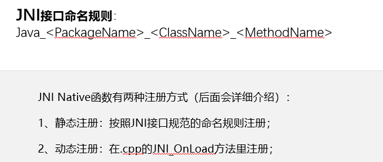
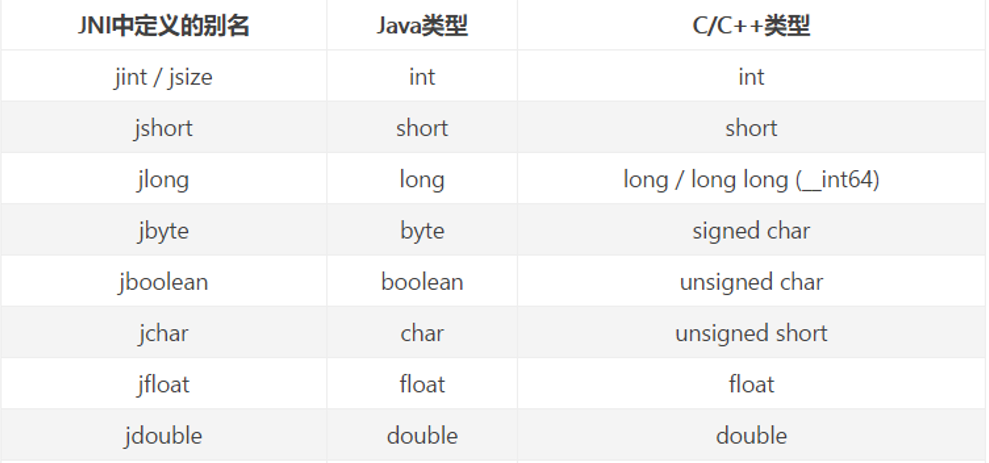
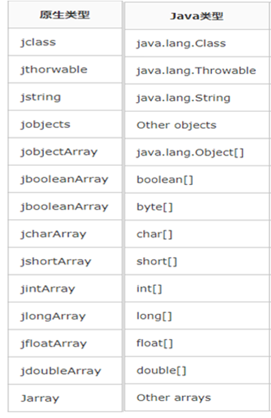
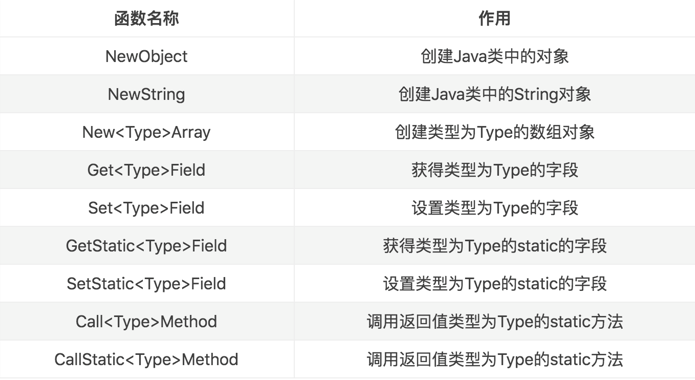
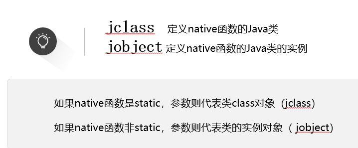
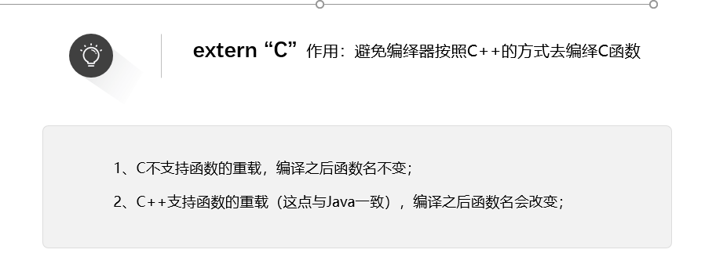
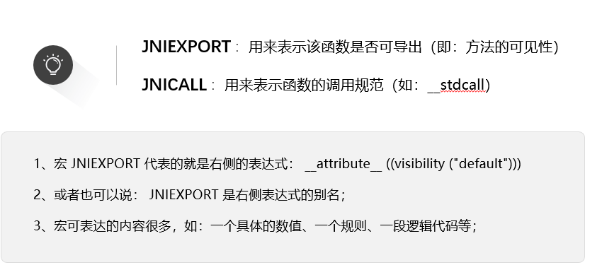
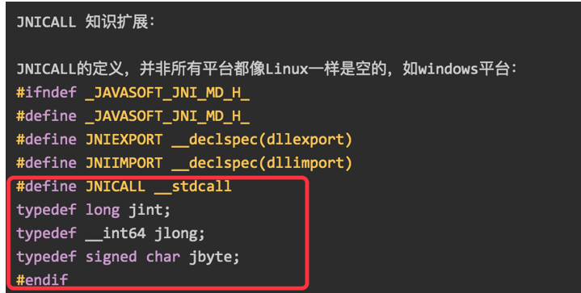
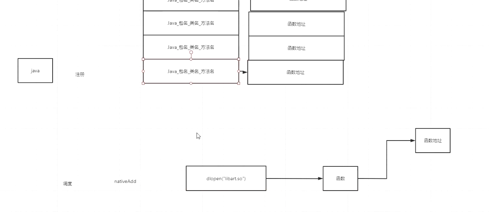

### 1.1 JNI(Java Native Interface)

> 提供一种Java字节码调用C/C++的解决方案，JNI描述的是一种技术。
>
> 

### 1.2 NDK(Native Development Kit)

> Android NDK 是一组允许您将 C 或 C++（“原生代码”）嵌入到 Android 应用中的工具，NDK描述的是工具集。 能够在 Android 应用中使用原生代码对于想执行以下一项或多项操作的开发者特别有用：

- 在平台之间移植其应用。
- 重复使用现有库，或者提供其自己的库供重复使用。
- 在某些情况下提高性能，特别是像游戏这种计算密集型应用。

### 1.3 JNI方法注册




#### 1.3.1静态注册

> 当Java层调用navtie函数时，会在JNI库中根据函数名查找对应的JNI函数。如果没找到，会报错。如果找到了，则会在native函数与JNI函数之间建立关联关系，其实就是保存JNI函数的函数指针。下次再调用native函数，就可以直接使用这个函数指针。

1. JNI函数名格式（需将”.”改为”_”）：

**Java_ + 包名（com.example.auto.jnitest）+ 类名(MainActivity) + 函数名(stringFromJNI)**

1. 静态方法的缺点：

- 要求JNI函数的名字必须遵循JNI规范的命名格式；
- 名字冗长，容易出错；
- **初次调用会根据函数名去搜索JNI中对应的函数，会影响执行效率；**
- **需要编译所有声明了native函数的Java类，每个所生成的class文件都要用javah工具生成一个头文件；**

#### 1.3.2动态注册

> 通过提供一个函数映射表，注册给JVM虚拟机，这样JVM就可以用函数映射表来调用相应的函数，就不必通过函数名来查找需要调用的函数。

1. Java与JNI通过JNINativeMethod的结构来建立函数映射表，它在jni.h头文件中定义，其结构内容如下：


```c
typedef struct {
    const char* name;
    const char* signature;
    void*       fnPtr;
} JNINativeMethod;
```

1. 创建映射表后，调用RegisterNatives函数将映射表注册给JVM;
2. **当Java层通过System.loadLibrary加载JNI库时，会在库中查JNI_OnLoad函数**。可将JNI_OnLoad视为JNI库的入口函数，需要在这里完成所有函数映射和动态注册工作，及其他一些初始化工作。

### 1.4 数据类型转换

#### 1.4.1 基础数据类型转换








#### 1.4.2 引用数据类型转换

> 除了Class、String、Throwable和基本数据类型的数组外，其余所有Java对象的数据类型在JNI中都用jobject表示。Java中的String也是引用类型，但是由于使用频率较高，所以在JNI中单独创建了一个jstring类型。


- 引用类型不能直接在 Native 层使用，需要根据 JNI 函数进行类型的转化后，才能使用;
- 多维数组（含二维数组）都是引用类型，需要使用 jobjectArray 类型存取其值；
   例如，二维整型数组就是指向一位数组的数组，其声明使用方式如下：


```c
    //获得一维数组的类引用，即jintArray类型  
    jclass intArrayClass = env->FindClass("[I");   
    //构造一个指向jintArray类一维数组的对象数组，该对象数组初始大小为length，类型为 jsize
    jobjectArray obejctIntArray  =  env->NewObjectArray(length ,intArrayClass , NULL);
```

#### 1.4.3 JNI函数签名信息

> 由于Java支持函数重载，因此仅仅根据函数名是没法找到对应的JNI函数。为了解决这个问题，JNI将参数类型和返回值类型作为函数的签名信息。

1. JNI规范定义的函数签名信息格式：
    **(参数1类型字符…)返回值类型字符**

2. 函数签名例子: 

   

3. JNI常用的数据类型及对应字符: 

   
   
   boolean 不是B 因为已经被byte占用了；long 不是L因为也被使用了
   
   


long？？？？？？？？？？？


#### 1.4.4 JNIEnv介绍

1. JNIEnv概念 :
    JNIEnv是一个**线程相关**的结构体, 该结构体代表了 Java 在本线程的运行环境。通过JNIEnv可以调用到一系列JNI系统函数。
2. JNIEnv线程相关性：
    **每个线程中都有一个 JNIEnv 指针。JNIEnv只在其所在线程有效, 它不能在线程之间进行传递。**


> **注意：在C++创建的子线程中获取JNIEnv，要通过调用JavaVM的AttachCurrentThread函数获得。在子线程退出时，要调用JavaVM的DetachCurrentThread函数来释放对应的资源，否则会出错。**


1. JNIEnv 作用：
   - **访问Java成员变量和成员方法；**
   - **调用Java构造方法创建Java对象等。**


jobject就是java方法所在的类对象；如果方法变成了static  jobject就变成了 jclass







**native改变java属性**

```C++
extern "C"
JNIEXPORT jstring JNICALL
Java_com_baoge_media_MainActivity_func1(JNIEnv *env, jobject thiz) {
    /**
     * 获取java方法所在类，在这里就是MainActivity
     */
    jclass activity = env->GetObjectClass(thiz);
    /**
     * 获取java类中的属性
     */
    jfieldID txtContentID = env->GetFieldID(activity,"txtContent", "Ljava/lang/String;");
    /**
     * 修改
     */
     jstring value = env->NewStringUTF("你被native改变了");
     env->SetObjectField(thiz,txtContentID,value);
    
    /**
     * 获取java类中的方法
     */
    jmethodID callBackID = env->GetMethodID(activity, "callBack", "(I)V");
    /**
     * 调用java类中的方法
     * CallVoidMethod 不同的返回值要调用不同的方法，static float object等
     */
    env->CallVoidMethod(thiz, callBackID, 2);
    

     //仅仅是个返回值
     std::string result = "func1";

    return env->NewStringUTF(result.c_str());


}
```


### 1.5 JNI编译

#### 1.5.1 ndkBuild

[使用ndk-build编译生成so文件](https://link.jianshu.com?t=http%3A%2F%2Fblog.csdn.net%2Fcheng2290%2Farticle%2Fdetails%2F77717164)

#### 1.5.2 Cmake编译

> CMake 则是一个跨平台的编译工具，它并不会直接编译出对象，而是根据自定义的语言规则（CMakeLists.txt）生成 对应 makefile 或 project 文件，然后再调用底层的编译， 在Android Studio 2.2 之后支持Cmake编译。

- add_library 指令

  语法：add_library(libname [SHARED | STATIC | MODULE] [EXCLUDE_FROM_ALL] [source])

  

  libname 相当于声明了一个变量；后面就可以使用这个变量
  
  
  
  将一组源文件 source 编译出一个库文件，并保存为 libname.so (lib 前缀是生成文件时 CMake自动添加上去的)。其中有三种库文件类型，不写的话，默认为 STATIC;
  
  - SHARED: 表示动态库，可以在(Java)代码中使用 System.loadLibrary(name) 动态调用；
  - STATIC: 表示静态库，集成到代码中会在编译时调用；
  - MODULE: 只有在使用 dyId 的系统有效，如果不支持 dyId，则被当作 SHARED 对待；
  - EXCLUDE_FROM_ALL: 表示这个库不被默认构建，除非其他组件依赖或手工构建;


```css
#将compress.c 编译成 libcompress.so 的共享库
add_library(compress SHARED compress.c)
```

- target_link_libraries 指令
   **语法：target_link_libraries(target library <debug | optimized> library2…)**
   这个指令可以用来为 target 添加需要的链接的共享库，同样也可以用于为自己编写的共享库添加共享库链接。如：


```bash
#指定 compress 工程需要用到 libjpeg 库和 log 库
target_link_libraries(compress libjpeg ${log-lib})
```

- find_library 指令
   **语法：find_library(<VAR> name1 path1 path2 ...)**
   VAR 变量表示找到的库全路径，包含库文件名 。例如：


```bash
find_library(libX  X11 /usr/lib)
find_library(log-lib log)  #路径为空，应该是查找系统环境变量路径
```

[Android NDK 开发：CMake 使用](https://www.jianshu.com/p/c71ec5d63f0d)

#### 1.5.3 Abi架构

> ABI（Application binary interface）应用程序二进制接口。不同的CPU 与指令集的每种组合都有定义的 ABI (应用程序二进制接口)，一段程序只有遵循这个接口规范才能在该 CPU 上运行，所以同样的程序代码为了兼容多个不同的CPU，需要为不同的 ABI 构建不同的库文件。当然对于CPU来说，不同的架构并不意味着一定互不兼容。

- armeabi设备只兼容armeabi；
- armeabi-v7a设备兼容armeabi-v7a、armeabi；
- arm64-v8a设备兼容arm64-v8a、armeabi-v7a、armeabi；
- X86设备兼容X86、armeabi；
- X86_64设备兼容X86_64、X86、armeabi；
- mips64设备兼容mips64、mips；
- mips只兼容mips；

根据以上的兼容总结，我们还可以得到一些规律：

- armeabi的SO文件基本上可以说是万金油，它能运行在除了mips和mips64的设备上，但在非armeabi设备上运行性能还是有所损耗；
- 64位的CPU架构总能向下兼容其对应的32位指令集，如：x86_64兼容X86，arm64-v8a兼容armeabi-v7a，mips64兼容mips；

#### 1.5.4  Jni技术实现原理

我们知道cpu只认得 “0101101” 类似这种符号， C、C++ 这些代码最终都得通过编译、汇编成二进制代码，cpu才能识别。而Java比C、C++又多了一层虚拟机，过程也复杂许多。Java代码经过编译成class文件、虚拟机装载等步骤最终在虚拟机中执行。class文件里面就是一个结构复杂的表，而最终告诉虚拟机怎么执行的就靠里面的字节码说明。

Java虚拟机在执行的时候，可以采用解释执行和编译执行的方式执行，但最终都是转化为机器码执行。

Java虚拟机运行时的数据区，包括方法区、虚拟机栈、堆、程序计数器、本地方法栈。

问题来了，按我目前的理解，如果是解释执行，那么方法区中应该存的是字节码，那执行的时候，通过JNI 动态装载的c、c++库，放哪去？怎么执行？这个问题，搜索了许多标题写着”JNI实现原理”的文章，都是抄来抄去，并没去探究如何实现的，只是讲了java如何使用JNI。好吧，就从如何使用JNI开始。

### 1.6 JNI的简单实现

参考文章：[《Java JNI简单实现》](http://vaero.blog.51cto.com/4350852/770139)、[《JAVA基础之理解JNI原理》](http://www.cnblogs.com/mandroid/archive/2011/06/15/2081093.html)


```c++
std::string hello = "Hello from C++";
return env->NewStringUTF(hello.c_str());

//  hello是存在于C的内存区域的，要给到java的内存区域要经过转换。  c_str 返回的指针 
//  通过这个指针拿到C++内存区域数据，在newString 在java内存 创建一个相同的字符串
```


假设当前的目录结构如下：

```
-
| - maniu
            | Test.java
 
```

1.首先编写java文件

Test.java

```java
package maniu;
public class Test{
        static{
                System.loadLibrary("bridge");
        }

        public native int nativeAdd(int x,int y);

        public static void main(String[] args){
                Test obj = new Test();
                System.out.printf("%d\n",obj.nativeAdd(2012,3));
        }
} 
```

代码很简单，这里声明了`nativeAdd(int x,inty)`的方法，执行的时候简单的打出执行的结果。另外这里调用API加载名称叫`bridge`的库，接下来就来实现这个库。

2.生成JNI调用需要的头文件

> javac maniu/Test.java
> javah -jni maniu.Test

现在目录结构是这样的：

```
-
| - maniu
            | Test.java
            | Test.class
| - maniu_Test.h
 
```

maniu_Test.h头文件内容如下：

```C
/* DO NOT EDIT THIS FILE - it is machine generated */
#include <jni.h>
/* Header for class maniu_Test */

#ifndef _Included_maniu_Test
#define _Included_maniu_Test
#ifdef __cplusplus
extern "C" {
#endif
/*
 * Class:     maniu_Test
 * Method:    nativeAdd
 * Signature: (II)I
 */
JNIEXPORT jint JNICALL Java_maniu_Test_nativeAdd
  (JNIEnv *, jobject, jint, jint);

#ifdef __cplusplus
}
#endif
 
```


#### 1.6.1 生成的代码阅读

经常会见到__cplusplus关键字，比如下面的代码：

```objectivec
#ifdef __cplusplus
extern "C" {
#endif
JNIEXPORT jint JNICALL Java_maniu_Test_nativeAdd
  (JNIEnv *, jobject, jint, jint);
#ifdef __cplusplus
}
#endif
```

  这里面，两种关键字，都是为了实现C++与C兼容的，**extern “C”是用来在C++程序中声明或定义一个C的符号，比如：**


```cpp
extern “C” {
   int func(int);
   int var;
 }
```

 上面的代码，**C++编译器会将在extern “C”的大括号内部的代码当做C语言来处理。**

 由于C和C++毕竟是不同的，为了实现某个程序在C和C++中都是兼容的，如果定义两套头文件，未免太过麻烦，所以就有了__cplusplus的出现，这个是在C++中特有的，__cplusplus其实就是C++，也就有了上面第一段代码的使用，如果这段代码是在C++文件中出现，那么经过编译后，该段代码就变成了：

```cpp
/**********C++文件中条件编译后结果***************/
extern "C" {
JNIEXPORT jint JNICALL Java_maniu_Test_nativeAdd
  (JNIEnv *, jobject, jint, jint);
}
```

 而在C文件中，经过条件编译，该段代码变成了：

```
/**********C文件中条件编译后结果*************/
JNIEXPORT jint JNICALL Java_maniu_Test_nativeAdd
  (JNIEnv *, jobject, jint, jint);
```

**//这部分笔记好像有问题，内容都是一样的。**

**按照视频的讲解，查找方法的时候是方法名和参数构成的一个整体字符串来唯一标记的。C++支持重载 会自动将将方法名加上JNIEnv *, jobject两个参数。**

**而C是没有这两个参数的。所以不加extern C 就相当于把原来的方法标记改了。导致代码执行的时候找不到方法，报错**



jint 代表返回值

JNICALL 空的宏；发现删除掉也不会影响方法调用


```C++
#define JNIIMPORT
//宏定义；  __attribute__ ((visibility ("default"))) 类似java的public private 可见性定义。  __attribute__属性 visibility 可见性 default默认属性  还有比如：hidden 
#define JNIEXPORT  __attribute__ ((visibility ("default")))
#define JNICALL
```







**3.native方法的实现**
这里新增`bridge.c`文件来实现之前声明的native方法，目录结构如下：

```
-
| - maniu
            | Test.java
            | Test.class
| - maniu_Test.h
| - bridge.c
 
```

bridge.c的内容如下：

```c
#include "maniu_Test.h"

JNIEXPORT jint JNICALL Java_maniu_Test_nativeAdd 
(JNIEnv * env, jobject obj, jint x, jint y){
        return x+y;
} 
```

这里的实现只是简单的把两个参数相加，然后返回。

**4.生成动态链接库**

> gcc -shared -o dll_demo.dll  bridge.c


最后需要注意一点的是 `-o` 选项，我们在java代码中调用的是`System.loadLibrary("xxx")`,那么生成的动态链接库的名称就必须是`libxxx.so`的形式（这里指Linux环境），否则在执行java代码的时候，就会报 `java.lang.UnsatisfiedLinkError: no XXX in java.library.path` 的错误！也就是说找不到这个库，我在这里被坑了一小段时间。
好了，现在的目录结构如下：

```
-
| - maniu
            | Test.java
            | Test.class
| - maniu_Test.h
| - bridge.c
| - libbridge.so
 
```

5.执行代码验证结果

> java -Djava.library.path=. maniu.Test
> 2015

ok，Java 使用JNI的最简单的例子就完成了。

------

#### 1.6.2 JNI实现原理

那么，我们的问题还没解决，刚刚生成的动态链接库”libbridge.so”是怎么装进内存的？native方法怎么调用？跟普通的方法调用有什么区别吗？

我们把Test.java改改，增加普通的方法”int add(int x,int y)”

Test.java

```java
package maniu;
public class Test{
        static{
                System.loadLibrary("bridge");
        }
        public native int nativeAdd(int x,int y);
        public int add(int x,int y){
                return x+y;
        }
        public static void main(String[] args){
                Test obj = new Test();
                System.out.printf("%d\n",obj.nativeAdd(2012,3));
                System.out.printf("%d\n",obj.add(2012,3));
        }
} 
```

我们把它编译成class文件，再看看class文件中，native方法和普通方法有何区别：

> javac maniu/Test.java
> javap -verbose maniu.Test

解析后，”nativeAdd”和”add”两个方法的结果如下：

```bytecode
  public native int nativeAdd(int, int);
    flags: ACC_PUBLIC, ACC_NATIVE

  public int add(int, int);
    flags: ACC_PUBLIC
    Code:
      stack=2, locals=3, args_size=3
         0: iload_1       
         1: iload_2       
         2: iadd          
         3: ireturn       
      LineNumberTable:
        line 8: 0
 
```

**可见，普通的“add”方法是直接把字节码放到“code属性表”中，而native方法，与普通的方法通过一个标志“ACC_NATIVE”区分开来。java在执行普通的方法调用的时候，可以通过找方法表，再找到相应的code属性表，最终解释执行代码，那么，对于native方法，在class文件中，并没有体现native代码在哪里，只有一个“ACC_NATIVE”的标识，那么在执行的时候改怎么找到动态链接库的代码呢？**

接着跟踪代码，只能从`System.loadLibrary()`入手了！下面是曲折的跟踪过程：



load so进来的时候会生成一个 java_包名__类名_方法名 为key，函数地址为value的表；调度执行方法的时候 就会hook libart.so 查找并执行

